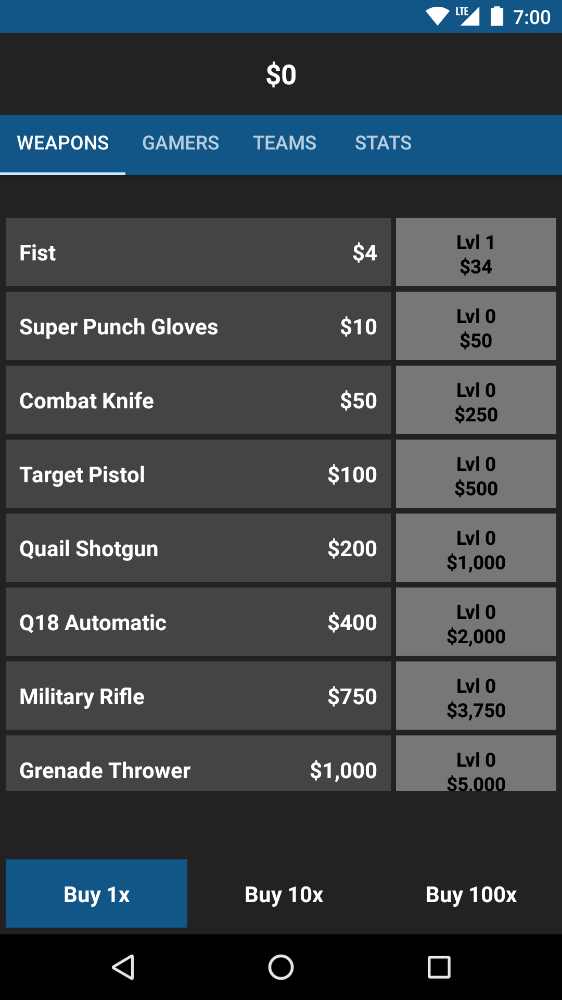
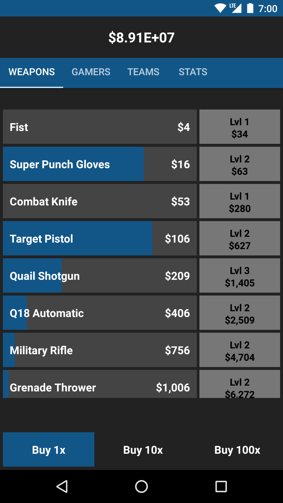
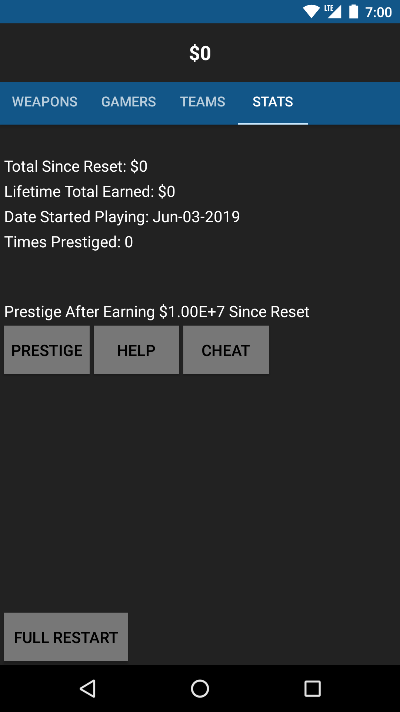

# IdleBattleRoyale

## Download
[Play Store](https://play.google.com/store/apps/details?id=com.ballardsoftware.idlebattle)

## Description
IdleBattleRoyale is an idle incremental game developed for Android. The goal of this game is simple: earn as much money as possible. 

## Rules
1. Weapons are used to earn money from tournaments. At the start you will have to do this yourself by clicking the weapon buttons.

2. Gamers use weapons to automatically earn money. This mean they click for you. At first they have a 10 second delay before each click, but they can be upgraded to become faster.

3. Teams provide a bonus to the Gamer in their team. Purchasing team upgrades provide a greater bonus.

4. Prestige to level up and earn a bonus for weapon income. You can prestige when you have $10,000,000. This will reset everything but Lifetime Total Money and Date Started Playing. You will earn a bonus to each weapon income for every time you have prestige.

5. Money is earned even while you are away. After you purchased a Gamer, they will continue to earn money when the game is closed.

## Tutorial
Start by clicking the Fist button to earn money. 

Once you make enough you can level up by clicking the upgrade button to increase the income for that weapon.

You can keep upgrading the weapon as you go, or save up to purchase a Gamer to click for you.

Purchasing a Team level will give a major boost to weapon income.

Continue purchasing and leveling up until you can prestige. Prestige as soon as you can to earn the maximum bonuses possible.

The cheat button is only in the Beta Version and fill be removed for final release. It will give you the $10,000,000 every time it's pushed. 
It is not recommended, except for testing purposes. 

The Full Restart button resets the game to initial install values. You will lose all progress.

## Future Plans

* Values for everyting will be reworked to keep the game more entertaining. 

* An Achievements tab will be added to provide bonuses for completing certain milestones.

* A Themes tab will be added to change the colors of the app.

* Future unlocks will be hidden. You will only see the next available purchase, allowing players to unlock items and progress.

* A Buy Max button will be added. It will allow you to purchase the maximum number of upgrades for weapons you have money for.
